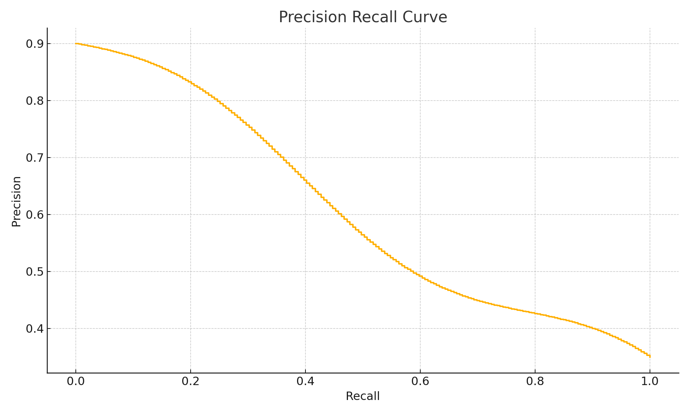
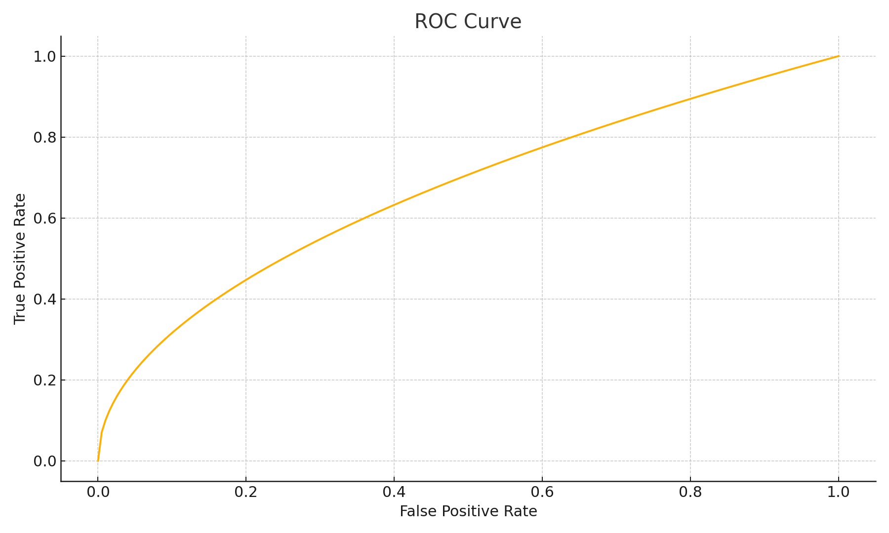

# Berkeley Transaction Risk Model

I turned my UC Berkeley research on card transaction fraud into a compact production ready pipeline. The goal is to show practical modeling choices for imbalanced transactions with time ordered validation and clean packaging that an engineering team can run end to end.

## Why this project

Fraud detection demands careful handling of temporal order and leakage. I built a single pipeline that loads and merges raw files, preprocesses numeric and categorical fields, tunes a gradient boosted classifier, and evaluates with out of fold predictions that respect time.

## Highlights

• Time ordered cross validation using TransactionDT  
• Honest out of fold metrics using ROC AUC and average precision  
• Single ColumnTransformer for preprocessing with imputation and scaling  
• Compact grid search over stable model settings suitable for imbalanced data  
• Reproducible training script that writes metrics, curves, and a serialized model  
• Small test and a basic CI workflow

## Figures

The training script produces the curves below. I included reference images so the README renders on first clone.

## Quick start

1. Create a new environment and install  
   pip install .

2. Place the required data in data/raw  
   train_transaction.csv  
   train_identity.csv

3. Train and produce outputs  
   python scripts/train.py

## Outputs

• reports/figures contains pr_curve.png and roc_curve.png  
• reports/tables contains cv_metrics.json and oof_predictions.csv  
• models contains fraud_model.joblib

## Data

The code expects the IEEE CIS fraud files named exactly as above. I keep data out of version control. See data/README.md for the expected file names.

## Results summary

On three time based folds from the study I observed approximate performance  
• ROC AUC around 0.901 plus or minus 0.012  
• Average precision around 0.562 plus or minus 0.059

## Project structure

repo root  
 src  
  fraud_risk  
   data.py and features.py and model.py and evaluate.py and plotting.py  
 scripts  
  train.py and evaluate.py  
 tests  
  test_pipeline.py  
 notebooks  
  UC_Berkeley_Fraud_Detection.ipynb  
 data  
  raw and processed  
 models  
 reports  
  figures and tables  
 .github  
  workflows  
 .gitignore and LICENSE and pyproject.toml and requirements.txt and README.md

## Notes 

I focused on the choices that matter in production. Respect temporal order. Avoid leakage. Prefer average precision when positives are rare. Keep one entry point for training and persist everything needed for audit.

## License

MIT
